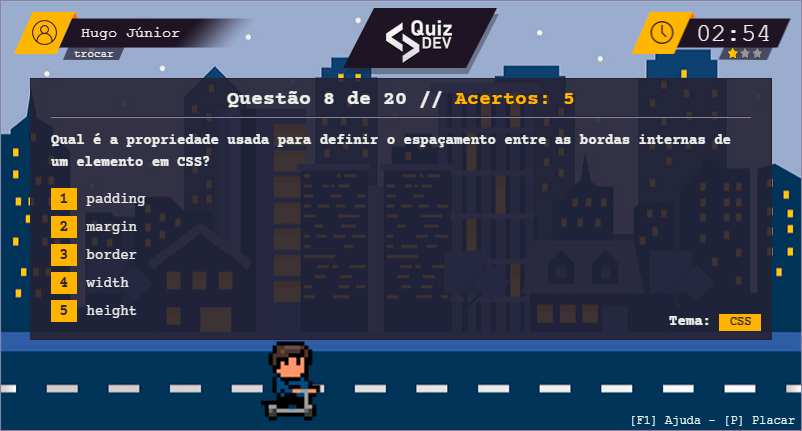

# QuizDev - Jogando e aprendendo!

> Esse projeto faz parte da disciplina de Estágio Supervisionado do Curso de Sistemas de Informação na UNI7. 

## Descrição
Este quiz é projetado para testar seus conhecimentos em tópicos importantes do mundo de desenvolvimento de software e tecnologia. Você será apresentado a uma série de tópicos importantes, como: **JavaScript**, **Docker**, **Linux**, **PHP**, **SQL** e etc...

Versão Online: https://quizdev.hugojunior.com/

## Rodando o projeto
Basta clonar o repositório em um WebServer, ou usar o plugin [Live Server](https://github.com/ritwickdey/vscode-live-server) no VSCode.

## Ferramentas utilizadas
- Phaser (Game Framework) - https://phaser.io/
- JavaScript (Linguagem de Programação) - https://www.javascript.com/
- QuizAPI (API de Questões) - https://quizapi.io/
- iStock (Imagens) - https://www.istockphoto.com/
- ColourLovers (Paleta de cores) - https://www.colourlovers.com/
- PixaBay (Efeitos Sonoros) - https://pixabay.com/pt/sound-effects/
- ChatGPT (Textos e Questões) - https://chat.openai.com/
